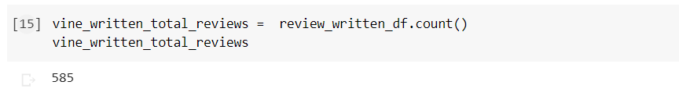
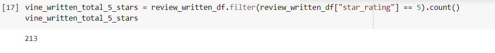
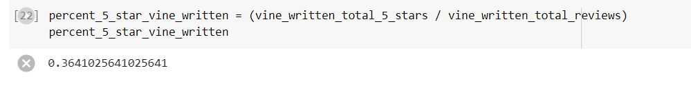
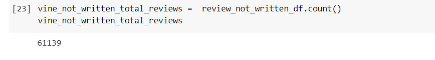
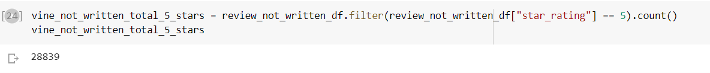
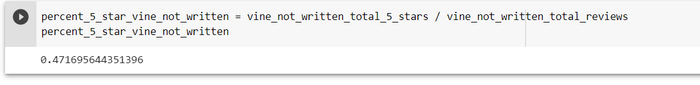

# Amazon_Vine_Analysis

# Overview

This analysis was done in an effort to analyze reviews on Amazon by paid members of the Amazon Vine program which allows manufacturers to receive reviews for their products by providing products to members of the program who are then required to review it. The company which sponsored this analysis, SellBy, is interested in seeing how membership in the Vine program might affect the likelihood of someone providing a five star review for the product they received.

# Results

In order to determine if being a member of the Amazon Vine Program has any effect on the percentage of five star reviews left I first calculated the total number of reviews left by members of the Vine Program:

I then calculated the total number of five star reviews amongst this review count:

Once these two data points were had it was simple to calculate the percentage of five star reviews left by members of the vine program:

We can thus see that roughly 36% of reviews left by members of the vine program are five star. 

In order to determine how the vine program might impact his percentage I needed to calculate the percent of five star reviews for the products that came from members that are not in the vine program.

First I calculated the total number of reviews left by non vine members:

Then the total number of these reviews that were five star:

From this I could then calculate the percentage of five star reviews:

We can see from this that the percentage of five star reviews left by non vine members was roughly 47%.

# Summary

We can see based upon the data that there does not seem to be any positive bias from vine members towards five star reviews. In fact the data seemed to support the oppposte as non vine members were roughly 10 percent more likely to leave five star reviews as members of the vine program were although one extra piece of analysis that could help the overall comprehension of this analysis is how the percent of five star review by vine members versus regular amazon reviewers might differ based upon product type
